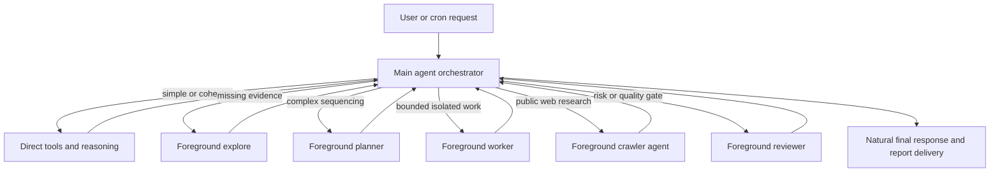

# Orchestrator Harness Implementation Plan

Status: implemented and locally validated
Scope: Nanobot agent harness only
Deployment target: the existing Lightsail Nanobot service

## Objective

Replace the current fixed `planner -> action -> verifier` harness with one main-agent
orchestrator loop. The main agent must decide at runtime whether a request needs direct work,
read-only exploration, planning, a foreground worker, Crawl4AI research, or independent
review.

All delegated agents in this design are foreground operations: the main agent waits for their
result before continuing. Background subagents remain unavailable.

## Confirmed product decisions

- The main agent owns the conversation, routing decisions, approvals, final answer, and result
  delivery.
- Simple questions and small tasks must run directly without mandatory planning or review.
- Planner, worker, and reviewer are optional tools selected by the main agent, not fixed phases.
- Delegated work is synchronous and non-recursive. A delegated agent cannot create another
  delegated agent.
- Crawl4AI remains a deterministic browser worker controlled by a foreground crawler agent.
- The crawler agent may use its configured lower-cost model and receives rendered cleaned HTML
  directly. Website evidence must not be replaced with a restrictive summary JSON contract.
- Internal routing state, role names, task IDs, verifier output, and system prompts must not be
  exposed in the user response.
- A scheduled cron run uses the same orchestrator path and returns only after all required
  foreground work completes.
- Client-facing responses should contain the concise, usable final result directly. Reports and
  working artifacts remain internal unless the user explicitly asks to receive a file.
- Internal research, analysis, and review records use compact Markdown as improvement-loop
  memory. They retain durable evidence, decisions, outcomes, and next improvements rather than
  reproducing the previous long user-facing report.
- Trend research, performance review, and daily content ideation synthesize a rolling window of
  approximately 14 days. They compare recency, repetition, momentum, source quality, and observed
  performance rather than mechanically consuming only the newest file. The idea identifies the
  trend evidence and performance learning that informed it; incomplete or stale evidence is
  disclosed rather than fabricated.

## Current implementation and problems

The present behavior is concentrated in `nanobot/agent/loop.py`:

1. `_should_plan_with_mode()` uses keywords and message length to decide whether a planner runs
   before the main agent.
2. `_run_internal_planner()` produces `_PlanDecision`, whose handoff is persisted and injected
   into the action context.
3. `_run_main_task()` always runs the action phase and conditionally starts the verifier from
   `_should_verify()`.
4. A failed verification automatically forces one revision and a second verification.

This creates several reliability problems:

- The main agent cannot decide naturally whether planning is useful because routing happens
  before it receives control.
- Keyword heuristics can over-plan ordinary work and miss complex work expressed without the
  expected verbs.
- The verifier can force a revision even when the main agent could resolve the issue directly or
  when review adds little value.
- Planner handoff metadata and history rewriting add state that can become stale across approval,
  cron, provider, and context-budget paths.
- `SubagentManager` mixes background spawning, foreground exploration, review, generation, and
  crawler behavior in one large component.
- `nanobot/agent/workflow.py` is not referenced by the runtime and represents a second unused
  workflow-state model.
- Background spawn code remains in the repository even though its tools are no longer registered.

## Target architecture



There is one outer `AgentRunner` loop. Delegation tools may start a separate, bounded
`AgentRunner`, but the tool call does not return until that delegated run finishes.

## Runtime routing rules

The orchestrator prompt should use the smallest sufficient route:

| Situation | Expected route |
|---|---|
| Conversation, lookup, or small clear edit | Work directly |
| Missing repository or factual evidence | Direct read tools, then `explore` if isolation is useful |
| Multiple dependent steps or important ambiguity | `plan_task` |
| Bounded implementation or artifact work benefits from isolated context | `delegate_task` |
| Public social/web page needs rendered browser interaction | `crawl_research` |
| Client deliverable, risky change, uncertain result, or explicit quality request | `review_work` |
| Destructive or external side effect | Main agent requests user approval; never delegate approval |

Calling a planner does not require calling a worker. Calling a worker does not automatically
require review. The main agent may call the same role again with correction instructions when
evidence justifies it, subject to the delegation budget.

## Foreground delegation API

Add `nanobot/agent/delegation.py` with a focused `ForegroundAgentManager`. It should own the
planner, worker, reviewer, explore, and crawler runners. It must not own message delivery,
background task registries, completion notifications, or session mirroring.

Add `nanobot/agent/tools/delegation.py` with three tools:

### `plan_task`

- Input: the objective plus a plain-text context/evidence block.
- Tools: read-only repository, web, and permitted MCP inspection tools.
- Output: a readable plan containing steps, dependencies, acceptance checks, references, risks,
  and unresolved questions.
- It cannot write files or call other delegation tools.

### `delegate_task`

- Input: one human-readable Markdown task contract and an explicit `write_scope`.
- The contract includes objective, current evidence, desired behavior, acceptance criteria,
  non-goals, allowed files, and validation commands.
- Tools: read tools plus write/edit and policy-constrained execution inside `write_scope`.
- It cannot call `message`, `cron`, approval-requiring external actions, or delegation tools.
- Output: a readable completion report with status, acceptance evidence, modified files, tests,
  blockers, and remaining risks.

The contract is passed to the worker unchanged as Markdown. JSON is used only for the outer tool
arguments; it must not replace raw evidence, HTML, excerpts, or references.

### `review_work`

- Input: the goal, acceptance criteria, relevant paths, and a concise evidence block.
- Tools: read-only file, shell, web, browser, and permitted MCP inspection tools.
- Output: findings first, acceptance coverage, test gaps, residual risks, and
  `PASS | CORRECT | REJECT`.
- It cannot modify files or call other delegation tools.

The main agent treats delegated output as evidence, not authority.

## Safety and execution limits

- Maximum delegation depth is one.
- Delegation tools set `supports_parallel_calls = False`; mixed tool batches therefore execute
  sequentially.
- A worker must receive at least one normalized workspace-relative write scope. A read-only task
  should use `explore`, `plan_task`, or `review_work` instead.
- Worker filesystem tools enforce the declared scope. Shell execution is restricted to safe
  workspace commands and cannot be used to bypass the scope.
- The main agent remains the only component allowed to request approval, send messages, schedule
  cron jobs, or perform deployment/publishing actions.
- Add a per-turn delegation budget, initially six total role calls and at most two worker
  correction calls. Exceeding it returns a clear tool error so the main agent can summarize the
  blocker instead of looping.
- Cancellation of the parent request cancels the active foreground delegate naturally; no
  separate task registry or completion message is needed.
- Tool results remain internal. Progress messages may say what work is happening, but must not
  mention internal role names or harness state.

## Main-loop changes

Refactor `AgentLoop` so `_process_message()` performs these steps only:

1. Resolve approval/session state.
2. Build the main-agent context and expose the permitted direct and delegation tools.
3. Run the main orchestrator through `AgentRunner` with `RiskyActionPolicy` plus delegation batch
   safety.
4. Save the completed turn, consolidate memory, and return the orchestrator's final response.

Remove the fixed-phase path:

- `_should_plan()` and `_should_plan_with_mode()`
- `_run_internal_planner()` and automatic planner handoff injection
- `_should_verify()` and automatic verifier/revision passes
- `_PlanDecision`, `_VerificationResult`, and planner handoff session metadata
- `planning_mode_override` and `skip_verification` as runtime routing controls

Update `ContextBuilder` with an orchestrator section that explains when each delegation tool earns
its cost. Tool-specific instructions should continue to be filtered by the actual registered tool
names.

## Configuration cleanup and migration

Do not maintain legacy and orchestrator harnesses in parallel. The implementation removes the
fixed harness and its controls in the same change. Git deployment rollback is the rollback
mechanism.

Remove these obsolete controls from runtime schemas, tool parameters, and call signatures:

- `AgentDefaults.planning_mode`
- `ContextBuilder.planning_mode`
- `AgentLoop.planning_mode` and `planning_mode_override`
- `CronPayload.planning_mode`
- `CronPayload.skip_verification`
- cron tool `planning_mode` and `skip_verification` arguments
- `process_direct(planning_mode=..., skip_verification=...)`

Before deployment, remove `planningMode` from the Lightsail configuration and make a backup of the
cron store. The cron loader should read only current fields, so obsolete keys in an existing JSON
record are discarded without creating a legacy execution branch. The next successful store write
permanently removes those keys.

Keep the existing dedicated crawler provider/model configuration. Planner, worker, and reviewer
should initially inherit the main provider/model; separate model routing is a later optimization
only if measurement shows a meaningful cost or quality benefit.

## Implementation work packages

### WP1 — Characterization and routing contracts

Ownership:

- `tests/agent/test_smart_harness.py`
- new `tests/agent/test_orchestrator_harness.py`
- new `tests/agent/test_foreground_delegation.py`

Work:

- Capture current approval, cron, context-budget, streaming, and session-save behavior that must
  survive the refactor.
- Add failing tests for direct routing, optional planning, optional review, awaited worker calls,
  non-recursion, and hidden internal state.
- Define the Markdown worker contract and completion/review footer parsers.

Acceptance:

- Tests prove a simple request can complete with one main-model call and no delegate.
- Tests prove a complex request can choose planner, worker, and reviewer in different sequences.
- Tests prove no background task or completion notification is created.

### WP2 — Foreground manager and tools

Ownership:

- new `nanobot/agent/delegation.py`
- new `nanobot/agent/tools/delegation.py`
- `nanobot/agent/tools/explore.py`
- `nanobot/agent/tools/crawler.py`
- focused delegation tests

Work:

- Extract reusable runner, prompt, tool-building, and result-formatting behavior from
  `SubagentManager`.
- Implement `plan_task`, `delegate_task`, and `review_work` as awaited tools.
- Repoint `explore` and `crawl_research` to the foreground manager.
- Enforce role-specific tool sets, write scope, call limits, and no recursive delegation.

Acceptance:

- Each role receives only its permitted tools.
- `delegate_task` blocks out-of-scope writes and returns actual validation evidence.
- The crawler continues using the configured crawler runner and receives rendered HTML directly.
- Parent cancellation cancels a running role call without a later notification.

### WP3 — Main orchestrator switch

Ownership:

- `nanobot/agent/loop.py`
- `nanobot/agent/context.py`
- `nanobot/agent/policy.py`
- `nanobot/agent/runner.py` only if policy composition needs a small extension
- orchestrator integration tests

Work:

- Register foreground delegation tools with the main agent.
- Add orchestration instructions and delegation batch policy.
- Simplify `_process_message()` and `_run_main_task()` to one main loop.
- Remove automatic planner, verifier, revision, and handoff behavior.
- Preserve approval pause/resume, streaming, context budgeting, message tools, and final session
  persistence.

Acceptance:

- The main agent can answer or act without a planner.
- The main agent can await any foreground role and continue reasoning from its result.
- Approval and streaming behavior match characterization tests.
- Only the main agent's final response is returned to the user.

### WP4 — Cron and configuration migration

Ownership:

- `nanobot/cli/commands.py`
- `nanobot/agent/tools/cron.py`
- `nanobot/cron/types.py`
- `nanobot/cron/service.py`
- `nanobot/config/schema.py`
- `nanobot/nanobot.py`
- configuration and cron tests

Work:

- Route cron jobs through the same orchestrator execution path.
- Ensure cron waits for planner/worker/reviewer/crawler tool completion.
- Remove obsolete fixed-harness fields from cron schemas, tool arguments, serialization, and
  execution calls. Ignore unknown obsolete keys when loading the existing store.
- Update examples and deployment documentation.

Acceptance:

- Existing cron schedules and destinations load without data loss while obsolete routing keys are
  discarded.
- Newly saved jobs omit obsolete fixed-harness controls.
- A scheduled research/report job delivers only the finished result.

### WP5 — Remove dormant harnesses

Ownership:

- `nanobot/agent/subagent.py`
- `nanobot/agent/tools/spawn.py`
- `nanobot/agent/tools/pipeline.py`
- `nanobot/agent/workflow.py`
- `nanobot/agent/write_guard.py`
- `nanobot/command/builtin.py`
- affected tests and exports

Work:

- Delete background spawn, pipeline, task registry, scope reservation, completion recording, and
  completion mirroring code after foreground tests pass.
- Delete the unused file-backed `WorkflowState` implementation after confirming no external
  package export references it.
- Keep only write-scope primitives still required by the foreground worker.
- Rename remaining subagent terminology to foreground delegation where it improves clarity.

Acceptance:

- Runtime and prompts contain no available background-spawn path.
- `/cancel` still cancels the active parent request and therefore its foreground delegate.
- Repository search finds no live imports of removed modules.

### WP6 — Integrated validation and Lightsail rollout

Work:

- Run lint and the focused agent, cron, configuration, crawler, and channel tests.
- Run the complete suite with development, Matrix, and crawler extras installed.
- Test locally with scripted provider responses for deterministic routing.
- Deploy one commit to Lightsail, restart Nanobot, and run smoke tests through the actual user
  channel.
- Keep the previous commit and service configuration as the rollback point.

Required smoke scenarios:

1. Simple conversation: no delegate and a normal answer.
2. Direct file task: main agent completes and verifies with direct tools.
3. Planned task: planner is called, main agent performs or delegates the work, and no internal
   plan is exposed.
4. Foreground worker: main response waits until the worker returns.
5. Reviewer correction: reviewer reports a concrete issue and the main agent chooses a bounded
   correction.
6. Crawl4AI: crawler uses its lower-cost model, reads rendered HTML, closes its session, and
   returns sources/limitations.
7. Cron result: the user receives one finished, concise result directly in the channel, without
   an "in progress" message or report attachment unless explicitly requested.
8. Approval: a risky action pauses, resumes after approval, and does not repeat completed work.

Validation commands:

```powershell
uv sync --extra dev --extra matrix --extra crawler-worker
uv run ruff check nanobot tests
uv run pytest tests/agent/test_orchestrator_harness.py tests/agent/test_foreground_delegation.py -q
uv run pytest tests/agent tests/cron tests/config tests/tools/test_social_crawl.py -q
uv run pytest -q
```

## Acceptance criteria for the complete change

- AC1: Simple tasks are not forced through planner or reviewer calls.
- AC2: The main agent can choose planner, worker, reviewer, explorer, and crawler independently.
- AC3: Every delegated role is foreground, awaited, cancellable with its parent, and unable to
  delegate recursively.
- AC4: The worker is restricted to its declared write scope and cannot perform user messaging,
  cron, deployment, publishing, or approval-requiring actions.
- AC5: Crawl4AI continues to expose rendered cleaned HTML directly to the crawler reasoning loop
  and can use its separately configured model.
- AC6: Cron runs use the same orchestrator loop and deliver only completed results.
- AC7: Approval, streaming, context budgets, session persistence, and provider tool-call legality
  do not regress.
- AC8: User responses never expose internal role names, system state, task IDs, or verifier
  transcripts.
- AC9: Fixed planner/action/verifier routing and background spawn code are removed rather than
  retained as permanent fallback paths.
- AC10: Focused and full automated suites pass before deployment, followed by successful
  Lightsail smoke tests.

## Non-goals

- Parallel foreground workers in the first version.
- Restoring background agents or later completion notifications.
- Letting delegated workers request approval or publish externally.
- Building a general persistent graph/workflow engine.
- Adding separate models for every role before cost and quality are measured.
- Changing EGOCAT research scope, report content, or client-facing report templates as part of
  this harness refactor.

## Recommended implementation order

Implement WP1 through WP6 sequentially. WP2 can be built without changing production routing,
but WP3 should delete and replace the fixed path in one bounded switch. Never ship both harnesses
in production. Complete WP5 before deployment so the deployed system has one understandable
orchestration model.
